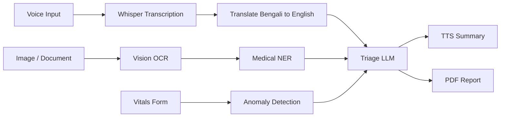

# Rural Healthcare Triage Assistant

AI-powered triage and decision-support backend for community health workers in rural Bangladesh.

## Problem Statement

This project helps a Community Health Worker collect patient symptoms, digitize OCR scans from prescriptions or lab reports, run AI-assisted triage reasoning, detect abnormal vitals, and generate a voice summary plus a PDF report for a supervising physician.

## Tech Stack

- Node.js
- Express
- OpenAI GPT-4o
- OpenAI Whisper
- Google Cloud Vision
- Google Cloud Translate
- Google Cloud Text-to-Speech
- PDFKit

## Architecture

Voice input and document images enter the API, where transcription and OCR normalize the data. OCR output is structured with medical entity extraction, symptoms and medical history are sent to the triage model, vitals are checked with rule-based anomaly logic, and the system returns a final triage response, an audio summary, and a generated PDF report.



## Setup

1. Clone the repository.
2. Install dependencies from the backend folder.
3. Copy `.env.example` to `.env` and fill in your API keys.
4. Start the backend with `npm start`.

The server reads `PORT` from `.env` and defaults to `5000` if not provided.

## API Endpoints

### `GET /api/health`

Response:

```json
{ "status": "ok" }
```

### `POST /api/transcribe`

Request body: multipart form-data with `audio`.

Response:

```json
{ "originalText": "...", "language": "bn|en", "translatedText": "..." }
```

### `POST /api/ocr`

Request body: multipart form-data with `document`.

Response:

```json
{ "rawText": "...", "medications": [], "diagnoses": [], "testResults": [] }
```

### `POST /api/analyze`

Request body:

```json
{
	"symptoms": "string",
	"medicalHistory": {},
	"vitalsAnomalyFlags": {}
}
```

Response:

```json
{
	"triageScore": "Green|Yellow|Red|Black",
	"reasoning": "...",
	"differentialDiagnoses": [],
	"firstAidSteps": [],
	"referralNeeded": true,
	"referralUrgency": "none|routine|urgent|immediate"
}
```

### `POST /api/vitals-check`

Request body:

```json
{
	"bloodPressureSys": 120,
	"bloodPressureDia": 80,
	"heartRate": 90,
	"temperature": 37,
	"oxygenSaturation": 98,
	"bloodGlucose": 110
}
```

Response:

```json
{
	"vitals": {
		"heartRate": { "value": 90, "status": "Normal" }
	},
	"overallAnomalyLevel": "None"
}
```

### `POST /api/tts`

Request body:

```json
{ "text": "...", "language": "bn|en" }
```

Response:

```json
{ "audioBase64": "...", "mimeType": "audio/mpeg" }
```

### `POST /api/report`

Request body:

```json
{
	"patientInfo": {},
	"intake": { "originalText": "...", "translatedText": "..." },
	"ocrData": { "medications": [], "diagnoses": [], "testResults": [] },
	"vitals": {},
	"triageResult": {}
}
```

Response:

```json
{ "reportUrl": "/uploads/reports/{uuid}.pdf" }
```

## Known Limitations

- The vitals anomaly detection is rule-based and should be replaced with a trained model when real population data is available.
- Triage reasoning depends on model output quality and should be reviewed by a licensed physician before clinical use.
- OCR and translation accuracy depend on image quality, handwriting legibility, and Google Cloud service availability.

## Credits

- OpenAI for GPT-4o and Whisper
- Google Cloud for Vision, Translate, and Text-to-Speech
- PDFKit for PDF generation
- Express for the HTTP server
- Multer for file uploads
- UUID for report file naming
